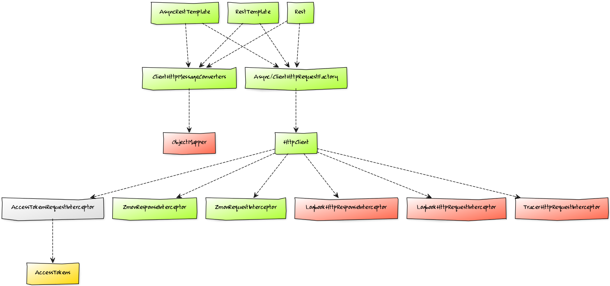

# Put it to REST!

[](https://pixabay.com/en/frog-meadow-relaxed-relaxation-fig-1109795/)

[](https://travis-ci.org/zalando-incubator/put-it-to-rest)
[](https://coveralls.io/r/zalando-incubator/put-it-to-rest)
[](http://www.javadoc.io/doc/org.zalando/put-it-to-rest)
[](https://github.com/zalando-incubator/put-it-to-rest/releases)
[](https://maven-badges.herokuapp.com/maven-central/org.zalando/put-it-to-rest)
[](https://raw.githubusercontent.com/zalando-incubator/put-it-to-rest/master/LICENSE)

Spring Boot REST client auto configuration

- **Technology stack**: Spring Boot
- **Status**:  Alpha

## Example

```yaml
rest.clients:
  example:
    base-url: http://example.com
    oauth.scopes:
      - example.read
```

```java
@RestClient("example")
private Rest example;
```

## Features

- Seamless integration of:
  - [Riptide](https://github.com/zalando/riptide)
  - [Logbook](https://github.com/zalando/logbook)
  - [Tracer](https://github.com/zalando/tracer)
  - [Tokens](https://github.com/zalando-stups/tokens) (plus [interceptor](https://github.com/zalando-stups/stups-spring-oauth2-support/tree/master/stups-http-components-oauth2))
  - [Jackson 2](https://github.com/FasterXML/jackson)
- [Spring Boot](http://projects.spring.io/spring-boot/) Auto Configuration
- Sensible defaults

## Dependencies

- Java 8
- Any build tool using Maven Central, or direct download
- Spring Boot
- Apache HTTP Async Client

## Installation

Add the following dependency to your project:

```xml
<dependency>
    <groupId>org.zalando</groupId>
    <artifactId>put-it-to-rest</artifactId>
    <version>${put-it-to-rest.version}</version>
</dependency>
```

If you want OAuth support you need to additionally add [stups-spring-oauth2-support](https://github.com/zalando-stups/stups-spring-oauth2-support/tree/master/stups-http-components-oauth2) to your project. 
It comes with [Tokens](https://github.com/zalando-stups/tokens) equipped. 

```xml
<!-- if you need OAuth support additionally add: -->
<dependency>
    <groupId>org.zalando.stups</groupId>
    <artifactId>stups-http-components-oauth2</artifactId>
    <version>$stups-http-components-oauth2.version}{</version>
</dependency>
```

## Configuration

You can now define new REST clients and override default configuration in your `application.yml`:

```yaml
rest:
  oauth:
    access-token-url: https://auth.example.com
    scheduling-period: 10
    timeouts:
      connect: 1000
      connect-unit: milliseconds
      read: 1500
      read-unit: milliseconds
  clients:
    example:
      base-url: https://example.com
      timeouts:
        connect: 2
        connect-unit: seconds
        read: 3
        read-unit: seconds
      oauth:
        scopes:
          - uid
          - example.read
```

Clients are identified by a *Client ID*, for instance `example` in the sample above. You can have as many clients as you want.

For a complete overview of available properties, they type and default value please refer to the following table:

| Configuration                             | Type           | Required | Default                          |
|-------------------------------------------|----------------|----------|----------------------------------|
| `rest.oauth.access-token-url`             | `URI`          | no       | env var `ACCESS_TOKEN_URL`       |   
| `rest.oauth.scheduling-period`            | `int`          | no       | `5`                              |
| `rest.oauth.timeouts.connect`             | `int`          | no       | `1`                              |
| `rest.oauth.timeouts.connect-unit`        | `TimeUnit`     | no       | `seconds`                        |
| `rest.oauth.timeouts.read`                | `int`          | no       | `2`                              |
| `rest.oauth.timeouts.read-unit`           | `TimeUnit`     | no       | `seconds`                        |
| `rest.clients.<id>.base-url`              | `URI`          | no       | none                             |
| `rest.clients.<id>.timeouts.connect`      | `int`          | no       | `5`                              |
| `rest.clients.<id>.timeouts.connect-unit` | `TimeUnit`     | no       | `seconds`                        |
| `rest.clients.<id>.timeouts.read`         | `int`          | no       | `5`                              |
| `rest.clients.<id>.timeouts.read-unit`    | `TimeUnit`     | no       | `seconds`                        |
| `rest.clients.<id>.oauth`                 |                | no       | none, disables OAuth2 if omitted |
| `rest.clients.<id>.oauth.scopes`          | `List<String>` | no       | none                             |

## Usage

After configuring your clients, as shown in the last section, you can now easily inject them:

```java
@RestClient("example")
private Rest example;
```

All beans that are created for each client use the *Client ID*, in this case `example`, as their qualifier.

Besides `Rest`, you can also alternatively inject any of the following types per client directly:
- `AsyncClientHttpRequestFactory`
- `HttpClient`
- `ClientHttpMessageConverters`

A global `AccessTokens` bean is also provided.

## Customization

For every client that is defined in your configuration the following graph of beans, indicated by the green color, will
be created:

[](https://raw.githubusercontent.com/zalando-incubator/put-it-to-rest/master/docs/graph.png)

Regarding the other colors:
- *yellow*: will be created once and then shared across different clients (if needed)
- *red*: mandatory dependency
- *grey*: optional dependency

Every single bean in the graph can optionally be replaced by your own, custom version of it. Beans can only be
overridden by name, **not** by type. As an example, the following code would add XML support to the `example` client:

```java
@Bean
@Qualifier("example")
public HttpMessageConverters exampleHttpMessageConverters() {
    return new HttpMessageConverters(new Jaxb2RootElementHttpMessageConverter());
}
```

The following table shows all beans with their respective name (for the `example` client) and type:

| Bean Name                              | Bean Type                       | Configures by default      |
|----------------------------------------|---------------------------------|----------------------------|
| `accessToken` (no client prefix!)      | `AccessTokens`                  | OAuth settings             |
| `exampleClientHttpMessageConverters`   | `ClientHttpMessageConverters`   | Text, JSON and JSON Stream |
| `exampleHttpClient`                    | `HttpClient`                    | Interceptors               |
| `exampleAsyncClientHttpRequestFactory` | `AsyncClientHttpRequestFactory` | Timeouts                   |
| `exampleRest`                          | `Rest`                          | Base URL                   |

If you override a bean then all of its dependencies (see the [graph](#customization)), will **not** be registered,
unless required by some other bean.

## Getting Help

If you have questions, concerns, bug reports, etc., please file an issue in this repository's
[Issue Tracker](issues).

## Getting Involved/Contributing

To contribute, simply make a pull request and add a brief description (1-2 sentences) of your addition or change. For
more details, check the [contribution guidelines](CONTRIBUTING.md).
